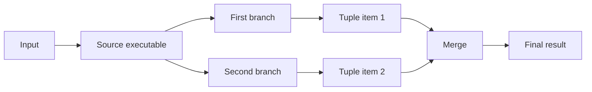

# Composition

## Chaining with `Then(...)` and `Compose(...)`

`Then(...)` is the basic left-to-right pipeline operator: output of one executable becomes input of the next.

`Compose(...)` is the symmetric form. It prepends the previous step to the current executable, so:

- `first.Then(second)` reads left to right,
- `second.Compose(first)` describes the same pipeline from the other side.

```csharp
IExecutable<string, int> parseLength =
  Executable.Create((string text) => text.Trim())
    .Then(text => text.Length);
```

```csharp
IExecutable<int, int> square = Executable.Create((int x) => x * x);
IExecutable<string, int> parse = Executable.Create((string text) => int.Parse(text));

IExecutable<string, int> leftToRight = parse.Then(square);
IExecutable<string, int> rightToLeft = square.Compose(parse);
```

This is useful when a chain is easier to express from the final executable backward, or when you want to insert a new
step before an existing pipeline without rewriting the whole expression.

## Dynamic Chaining with `FlatMap(...)`

`FlatMap(...)` is useful when the next executable depends on the value produced by the previous step.

Instead of always continuing with the same executable, it selects the next executable dynamically and then flattens the
result back into one executable pipeline.

```csharp
IExecutable<int, int> sum = Executable.Create((int x) => x + x);
IExecutable<int, int> fallback = Executable.Create((int _) => 0);

IExecutable<int, int> choose =
  Executable.Create((int x) => x)
    .FlatMap(x => x > 0 ? sum : fallback);
```

This is different from `Then(...)` in one important way:

- `Then(...)` always continues with the same next step,
- `FlatMap(...)` chooses the next step from the current value.

The same pattern is also available for asynchronous pipelines through `IAsyncExecutable<TIn, TOut>.FlatMap(...)`.

## Parallel Branching with `Fork(...)`

`Fork(...)` sends one result into two branches and returns a tuple. In many cases the tuple is only an intermediate
shape, and `Merge(...)` is used immediately to combine both branch results into one value again.



```csharp
IExecutable<string, string> summary =
  Executable.Create((string text) => text.Trim())
    .Fork(
      text => text.Length,
      text => text.ToUpperInvariant())
    .Merge((length, upper) => $"{upper} ({length})");
```

### Tuple Helpers

After a fork, tuple-oriented operators can also transform the tuple before a final merge:

- `First(...)` transforms the first tuple item,
- `Second(...)` transforms the second tuple item,
- `Swap()` reverses the tuple item order.

```csharp
IExecutable<string, string> reordered =
  Executable.Create((string text) => text.Trim())
    .Fork(text => text.Length, text => text.ToUpperInvariant())
    .Swap()
    .First(text => $"Value: {text}")
    .Second(length => length * 2)
    .Merge((text, length) => $"{text} ({length})");
```

## Accumulating Intermediate Values with `Accumulate(...)`

`Accumulate(...)` appends a new value while keeping the values that were already computed.

This is useful when later steps need access not only to the latest result, but also to earlier intermediate values.

```csharp
IExecutable<int, string> summary =
  Executable
    .Accumulate((int x) => x + x)
    .Accumulate((x, y) => x + y)
    .Accumulate((x, y, z) => x + y + z)
    .Merge((x, y, z, total) => $"{x}, {y}, {z}, {total}");
```

For input `1`, this chain produces:

- `x = 1`
- `y = 2`
- `z = 3`
- `total = 6`

So the final result is `"1, 2, 3, 6"`.

## Contract Adaptation

`Map(...)` adapts an executable to a different external contract by transforming input before execution and output after
execution.

Conceptually it is a convenience wrapper over `Compose(...)` for the input side and `Then(...)` for the output side.

```csharp
IExecutable<int, int> square = Executable.Create((int x) => x * x);

IExecutable<string, string> squareText =
  square.Map(
    text => int.Parse(text),
    value => $"Result: {value}");
```

The same adaptation can be written explicitly:

```csharp
IExecutable<string, string> squareTextExplicit =
  square
    .Compose((string text) => int.Parse(text))
    .Then(value => $"Result: {value}");
```

## Reversible Adaptation with `IIso<T1, T2>`

`Map(...)` adapts one executable contract around one executable.

`IIso<T1, T2>` models something different: a reusable reversible transformation between two types. It has two
directions:

- `Forward(...)` converts `T1` to `T2`,
- `Backward(...)` converts `T2` back to `T1`.

Create an isomorphism with `Iso.Create(...)`:

```csharp
IIso<Guid, string> guidText = Iso.Create(
  guid => guid.ToString("N"),
  text => Guid.ParseExact(text, "N"));
```

You can compose isomorphisms with the same left-to-right / right-to-left symmetry as executables:

```csharp
IIso<string, char[]> chars = Iso.Create(
  text => text.ToCharArray(),
  chars => new string(chars));

IIso<Guid, char[]> guidChars = guidText.Then(chars);
IIso<char[], Guid> parseGuidChars = guidChars.Inverse();
```

When you need only the forward direction inside executable composition, expose it as an executable:

```csharp
IExecutable<string, string> normalizeGuid =
  guidText
    .Inverse()
    .AsExecutable()
    .Then(guidText.AsExecutable());
```

For endomorphisms, `MapIso(...)` is the direct bridge between executable composition and reversible adaptation. It maps
an executable of shape `IExecutable<T2, T2>` through an `IIso<T1, T2>` and gives back `IExecutable<T1, T1>`.

```csharp
IIso<string, Guid> guidText = Iso.Create(
  text => Guid.Parse(text),
  guid => guid.ToString("D"));

IExecutable<string, string> normalizeGuid =
  Executable.Create((Guid guid) => guid)
    .MapIso(guidText);
```

The same idea also exists for asynchronous endomorphisms through `IAsyncExecutable<T2, T2>.MapIso(...)`.

Use `IIso<T1, T2>` when the transformation itself is a reusable concept and both directions matter. Use `Map(...)`
when you only need to adapt one executable contract around a specific executable chain.

## LINQ Integration

The library supports LINQ-style composition for executable pipelines and collection-style execution through executor
enumeration helpers.

### Query Syntax for Executables

```csharp
IExecutable<int, Optional<TimeSpan>> executable =
  from time in Executable.Create((int seconds) => TimeSpan.FromSeconds(seconds))
  where time >= TimeSpan.Zero
  where time < TimeSpan.FromSeconds(60)
  select time;
```

### Enumerable Execution via Executors

```csharp
IExecutor<int, TimeSpan> toTime =
  Executable.Create((int seconds) => TimeSpan.FromSeconds(seconds))
    .GetExecutor();

foreach (TimeSpan value in toTime.ForEach(new[] { 1, 2, 3, 4, 5 }))
  Console.WriteLine(value);
```

For optimization, `ForEach(...)` uses struct-based enumerable/enumerator implementations for common collection types
such as arrays, lists, queues, stacks, hash sets, and spans.

### Flattened Execution via `ForEachMany(...)`

```csharp
IExecutor<int, int[]> expand =
  Executable.Create((int value) => new[] { value, value * 10 })
    .GetExecutor();

foreach (int item in expand.ForEachMany(new[] { 1, 2, 3 }))
  Console.WriteLine(item);
```

`ForEachMany(...)` provides optimized struct wrappers for common *result* collection shapes returned by the executor
(`T[]`, `List<T>`, `HashSet<T>`, `Queue<T>`, `Stack<T>`).

Its input is accepted as `IEnumerable<T>`, so source enumeration goes through the interface and can cause a small
allocation per `ForEachMany(...)` usage (for example, when a value-type source enumerator is boxed).

## Query and Command Composition

Queries do not need a separate composition API. Because `IQuery<TIn, TOut>` is also an `IExecutable<TIn, TOut>`, query
logic composes through the usual executable operators such as `Then(...)` and `Compose(...)`.

```csharp
IExecutable<string, string> pipeline =
  Executable.Create((string text) => int.Parse(text))
    .Then(value => $"Value: {value}");

IQuery<string, string> query = pipeline.AsQuery();
```

Commands have command-specific composition operators: `Append(...)` and `Prepend(...)`.

```csharp
ICommand<string> first =
  Executable.Create((string value) => true).AsCommand();

ICommand<string> second =
  Executable.Create((string value) => true).AsCommand();

ICommand<string> combined = first.Append(second);
ICommand<string> sameCombined = second.Prepend(first);
```

`Append(...)` uses left-to-right short-circuit semantics: if the first command returns `false`, the second command is
not executed. `Prepend(...)` expresses the same idea from the other side.

## Racing Async Executables

For asynchronous pipelines, `Race(...)` and `RaceSuccess(...)` let multiple follow-up executables compete against each
other.

- `Race(...)` returns the first completed result,
- `RaceSuccess(...)` returns the first successful result.
- `Race(...)` fails when the first completed executable finishes with an exception.
- `RaceSuccess(...)` fails only when all competing executables fail:
    - if all of them fail with exceptions, those exceptions are aggregated,
    - if all of them are canceled, it throws `OperationCanceledException`.

These operators are useful when several asynchronous providers can handle the same input and you want either:

- the fastest answer, or
- the fastest successful answer.

```csharp
IAsyncExecutable<string, string> fastest = AsyncExecutable.Race(
  async (string text, CancellationToken token) =>
  {
    await Task.Delay(10, token);
    return $"Slow: {int.Parse(text)}";
  },
  async (string text, CancellationToken token) =>
  {
    await Task.Delay(5, token);
    return $"Fast: {int.Parse(text)}";
  });

string fastestResult = await fastest.GetExecutor().Execute("42");
// Returns "Fast: 42".
```

```csharp
IAsyncExecutable<string, string> firstSuccessful = AsyncExecutable.RaceSuccess(
  async (string text, CancellationToken token) =>
  {
    await Task.Delay(5, token);
    throw new InvalidOperationException("Provider failed");
  },
  async (string text, CancellationToken token) =>
  {
    await Task.Delay(20, token);
    return $"Recovered: {int.Parse(text)}";
  });

string recoveredResult = await firstSuccessful.GetExecutor().Execute("42");
// Returns "Recovered: 42".
```

If you want the losing executions to be canceled after the first completion, combine racing with
`CancelAfterCompletion()`.

```csharp
bool canceled = false;

IAsyncExecutor<string, string> fastestWithCancellation =
  AsyncExecutable.Create(async (string text, CancellationToken token) =>
  {
    await Task.Delay(10, token);
    return int.Parse(text);
  })
  .Race(
    async (int value, CancellationToken token) =>
    {
      try
      {
        await Task.Delay(100, token);
      }
      catch (OperationCanceledException)
      {
        canceled = true;
      }

      return $"Slow: {value}";
    },
    async (int value, CancellationToken token) =>
    {
      await Task.Delay(5, token);
      return $"Fast: {value}";
    })
  .GetExecutor()
  .WithPolicy(policy => policy.CancelAfterCompletion());

string result = await fastestWithCancellation.Execute("42");
// Returns "Fast: 42", and `canceled` becomes true for the losing execution.
```

## Composition Laws

The executable API is designed so that composition stays predictable as pipelines grow.

- composition symmetry: `f.Compose(g)` is equivalent to `g.Then(f)`,
- associativity: regrouping a chain does not change the result,
- identity: `Executable.Identity<T>()` composes without changing behavior,
- fork distributivity: composing before a `Fork(...)` is equivalent to composing into each branch.

Composition symmetry:

```csharp
IExecutable<int, int> f = Executable.Create((int x) => x * x);
IExecutable<string, int> g = Executable.Create((string text) => int.Parse(text));

IExecutable<string, int> left = f.Compose(g);
IExecutable<string, int> right = g.Then(f);
```

Associativity:

```csharp
IExecutable<string, int> f = Executable.Create((string text) => int.Parse(text));
IExecutable<int, int> g = Executable.Create((int x) => x * x);
IExecutable<int, string> h = Executable.Create((int x) => x.ToString());

IExecutable<string, string> left = f.Then(g).Then(h);
IExecutable<string, string> right = f.Then(g.Then(h));
```

Identity:

```csharp
IExecutable<int, int> f = Executable.Create((int x) => x * x);
IExecutable<int, int> id = Executable.Identity<int>();

IExecutable<int, int> left = f.Then(id);
IExecutable<int, int> right = id.Then(f);
```

Fork distributivity:

```csharp
IExecutable<int, int> f = Executable.Create((int x) => x + x);
IExecutable<int, int> g = Executable.Create((int x) => x * x);
IExecutable<string, int> h = Executable.Create((string text) => int.Parse(text));

IExecutable<string, (int, int)> left = Executable.Fork(f, g).Compose(h);
IExecutable<string, (int, int)> right = Executable.Fork(f.Compose(h), g.Compose(h));
```

These properties are useful in practice because they let you reorder, regroup, and extract pipeline parts without
changing observable behavior.
