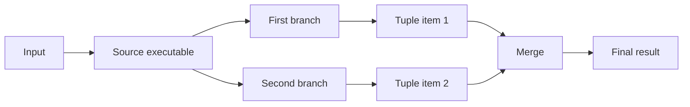
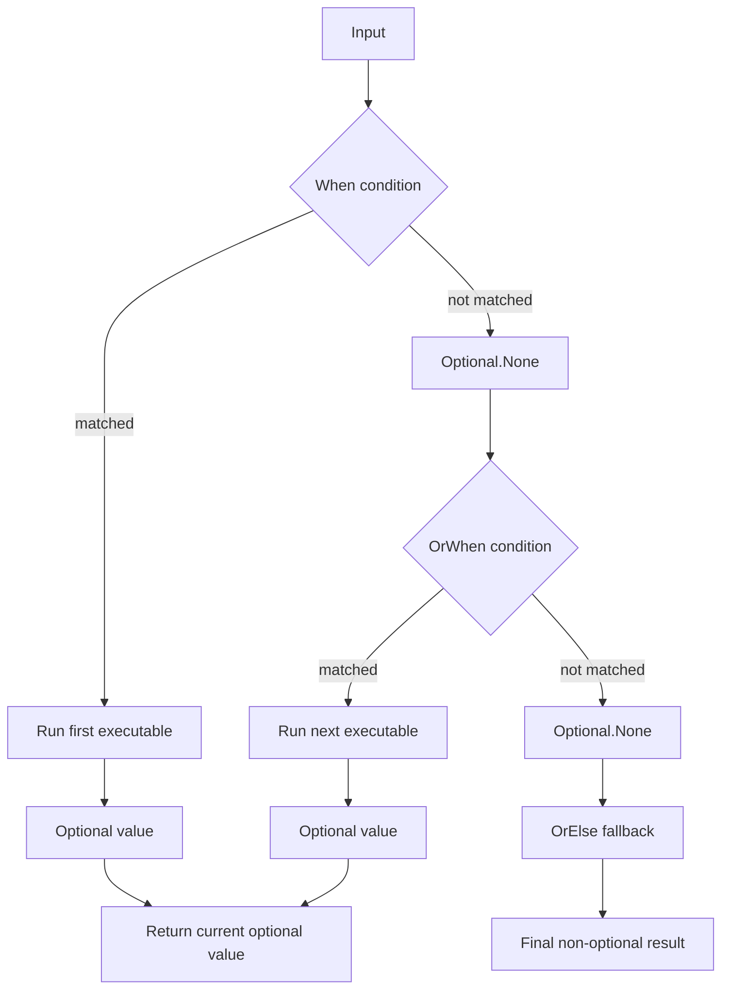

# Composition

## Chaining with `Then(...)` and `Compose(...)`

`Then(...)` is the basic left-to-right pipeline operator: output of one executable becomes input of the next.

`Compose(...)` is the symmetric form. It prepends the previous step to the current executable, so:

- `first.Then(second)` reads left to right,
- `second.Compose(first)` describes the same pipeline from the other side.

```csharp
IExecutable<string, int> parseLength =
  Executable.Create((string text) => text.Trim())
    .Then(text => text.Length);
```

```csharp
IExecutable<int, int> square = Executable.Create((int x) => x * x);
IExecutable<string, int> parse = Executable.Create((string text) => int.Parse(text));

IExecutable<string, int> leftToRight = parse.Then(square);
IExecutable<string, int> rightToLeft = square.Compose(parse);
```

This is useful when a chain is easier to express from the final executable backward, or when you want to insert a new
step before an existing pipeline without rewriting the whole expression.

## Parallel Branching with `Fork(...)`

`Fork(...)` sends one result into two branches and returns a tuple. In many cases the tuple is only an intermediate
shape, and `Merge(...)` is used immediately to combine both branch results into one value again.



```csharp
IExecutable<string, string> summary =
  Executable.Create((string text) => text.Trim())
    .Fork(
      text => text.Length,
      text => text.ToUpperInvariant())
    .Merge((length, upper) => $"{upper} ({length})");
```

## Tuple Helpers

After a fork, tuple-oriented operators can also transform the tuple before a final merge:

- `First(...)`
- `Second(...)`
- `Swap()`

```csharp
IExecutable<string, string> reordered =
  Executable.Create((string text) => text.Trim())
    .Fork(text => text.Length, text => text.ToUpperInvariant())
    .Swap()
    .First(text => $"Value: {text}")
    .Second(length => length * 2)
    .Merge((text, length) => $"{text} ({length})");
```

## Contract Adaptation

`Map(...)` adapts an executable to a different external contract by transforming input before execution and output after
execution.

Conceptually it is a convenience wrapper over `Compose(...)` for the input side and `Then(...)` for the output side.

```csharp
IExecutable<int, int> square = Executable.Create((int x) => x * x);

IExecutable<string, string> squareText =
  square.Map(
    text => int.Parse(text),
    value => $"Result: {value}");
```

The same adaptation can be written explicitly:

```csharp
IExecutable<string, string> squareTextExplicit =
  square
    .Compose((string text) => int.Parse(text))
    .Then(value => $"Result: {value}");
```

## Reusable Transformations

`Tap(...)` observes results while preserving them, and `Pipe(...)` applies a reusable composition function.

```csharp
IExecutable<int, string> pipeline =
  Executable.Create((int x) => x + 1)
    .Tap(value => Console.WriteLine(value))
    .Pipe(executable => executable.Then(value => $"Value: {value}"));
```

## Query and Command Composition

Queries compose with `Connect(...)`, commands compose with `Compose(...)`.

```csharp
IQuery<string, int> parse =
  Executable.Create((string text) => int.Parse(text))
    .AsQuery();

IQuery<int, string> format =
  Executable.Create((int value) => $"Value: {value}")
    .AsQuery();

IQuery<string, string> chained = parse.Connect(format);
```

```csharp
ICommand<string> first =
  Executable.Create((string value) => true).AsCommand();

ICommand<string> second =
  Executable.Create((string value) => true).AsCommand();

ICommand<string> combined = first.Compose(second);
```

`Compose(...)` uses short-circuit semantics: if the first command returns `false`, the second command is not executed.

## Racing Async Executables

For asynchronous pipelines, `Race(...)` and `RaceSuccess(...)` let multiple follow-up executables compete against each
other.

- `Race(...)` returns the first completed result,
- `RaceSuccess(...)` returns the first successful result.
- `Race(...)` fails when the first completed executable finishes with an exception.
- `RaceSuccess(...)` fails only when all competing executables fail:
    - if all of them fail with exceptions, those exceptions are aggregated,
    - if all of them are canceled, it throws `OperationCanceledException`.

These operators are useful when several asynchronous providers can handle the same input and you want either:

- the fastest answer, or
- the fastest successful answer.

```csharp
IAsyncExecutable<string, int> parse =
  AsyncExecutable.Create(async (string text, CancellationToken token) =>
  {
    await Task.Delay(10, token);
    return int.Parse(text);
  });

IAsyncExecutable<string, string> fastest =
  parse.Race(
    async (int value, CancellationToken token) =>
    {
      await Task.Delay(50, token);
      return $"Slow: {value}";
    },
    async (int value, CancellationToken token) =>
    {
      await Task.Delay(5, token);
      return $"Fast: {value}";
    });

string fastestResult = await fastest.GetExecutor().Execute("42");
// Returns "Fast: 42".
```

```csharp
IAsyncExecutable<string, string> firstSuccessful =
  parse.RaceSuccess(
    async (int value, CancellationToken token) =>
    {
      await Task.Delay(5, token);
      throw new InvalidOperationException("Provider failed");
    },
    async (int value, CancellationToken token) =>
    {
      await Task.Delay(20, token);
      return $"Recovered: {value}";
    });

string recoveredResult = await firstSuccessful.GetExecutor().Execute("42");
// Returns "Recovered: 42".
```

If you want the losing executions to be canceled after the first completion, combine racing with
`CancelAfterCompletion()`.

```csharp
bool canceled = false;

IAsyncExecutable<string, string> fastestWithCancellation =
  AsyncExecutable.Create(async (string text, CancellationToken token) =>
  {
    await Task.Delay(10, token);
    return text;
  })
  .Race(
    async (string value, CancellationToken token) =>
    {
      try
      {
        await Task.Delay(100, token);
      }
      catch (OperationCanceledException)
      {
        canceled = true;
      }

      return $"Slow: {value}";
    },
    async (string value, CancellationToken token) =>
    {
      await Task.Delay(5, token);
      return $"Fast: {value}";
    })
  .WithPolicy(policy => policy.CancelAfterCompletion());

string result = await fastestWithCancellation.GetExecutor().Execute("42");
// Returns "Fast: 42", and `canceled` becomes true for the losing execution.
```

## Explicit Branching

For condition-based routing, start with `When(...)`, continue with `OrWhen(...)`, and finish with `OrElse(...)`.

`When(...)` and `OrWhen(...)` return `Optional<T>` because each branch may decide not to handle the input.
`OrElse(...)` closes the chain with the final fallback and returns a regular non-optional result.



```csharp
int state = 1;

IQuery<Unit, string> stateText =
  Executable.When(() => state == 0, () => "Init")
    .OrWhen(() => state == 1, () => "Running")
    .OrElse(() => "Unknown")
  .AsQuery();
```

You can also keep the chain in its optional form when no final fallback is needed.

```csharp
IExecutable<int, Optional<string>> classify =
  Executable.When((int value) => value < 0, value => "negative")
    .OrWhen(value => value > 0, value => "positive");
```

This model makes the branching contract explicit:

- each conditional branch may either produce a value or skip handling,
- later branches run only when earlier ones produce `Optional.None`,
- the final `OrElse(...)` turns the chain back into a required result.

## Composition Laws

The executable API is designed so that composition stays predictable as pipelines grow.

- composition symmetry: `f.Compose(g)` is equivalent to `g.Then(f)`,
- associativity: regrouping a chain does not change the result,
- identity: `Executable.Identity<T>()` composes without changing behavior,
- fork distributivity: composing before a `Fork(...)` is equivalent to composing into each branch.

```csharp
IExecutable<int, int> square = Executable.Create((int x) => x * x);
IExecutable<string, int> parse = Executable.Create((string text) => int.Parse(text));

IExecutable<string, int> a = parse.Then(square);
IExecutable<string, int> b = square.Compose(parse);
```

These properties are useful in practice because they let you reorder, regroup, and extract pipeline parts without
changing observable behavior.
