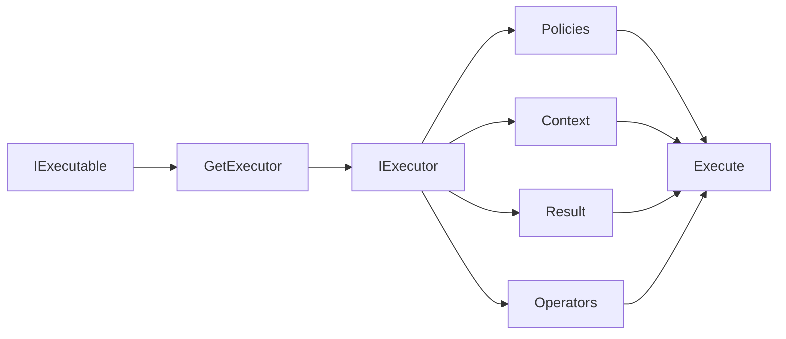
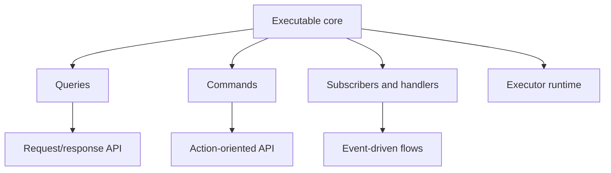

# Conceptual Model

## Executables as the Core Abstraction

The model starts from one decision: treat behavior as a typed value with an explicit contract.

Once behavior has an explicit input and output contract, it can be composed, adapted, branched, reused, and exposed
through different API shapes without rewriting the logic itself.

## Separating Definition from Invocation

An `IExecutable<TIn, TOut>` describes behavior. An `IExecutor<TIn, TOut>` is the runtime object that actually performs
`Execute(...)`.

This split keeps the model flexible:

- executables are reusable, pure composition building blocks,
- executors are the runtime invocation boundary where policies and execution control are applied.

Because of that split, one executable composition can be reused with multiple runtime configurations. The same
`IExecutable<TIn, TOut>` can be turned into different executors with different policies, operators, context handling,
or result behavior, without changing the composition itself.

## Commands, Queries, and Events

Commands, queries, and events are treated as related interaction contracts, not as isolated patterns:

- commands represent action-oriented execution,
- queries represent request/response execution,
- events represent publish/subscribe execution.

Because they sit close to the same abstraction family, the same underlying logic can often be exposed through more than
one shape.

## Composition Over Inheritance

The library prefers building behavior from small composable operations rather than embedding it into service
hierarchies or tightly coupled object graphs.

That has two practical effects:

- behavior can be assembled from reusable pieces without moving logic into inheritance structures,
- the same composed behavior can later be adapted, executed, or exposed through different API shapes without rewriting
  the core flow.

## Sync and Async as Parallel APIs

Synchronous and asynchronous pipelines are modeled as parallel APIs with matching mental models.

The distinction stays explicit:

- sync chains stay simple,
- async chains stay strongly typed,
- mixed sync/async flows are supported through explicit adaptation.
