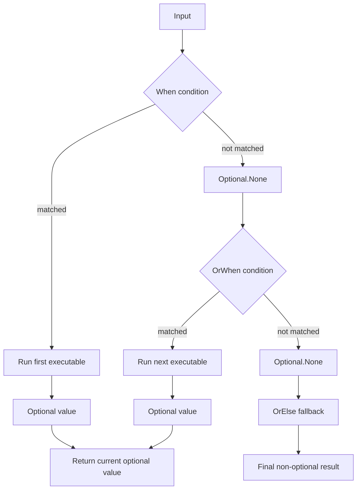

# Execution Runtime

This section describes the executor runtime.

`IExecutable<TIn, TOut>` defines composition. `IExecutor<TIn, TOut>` is where execution actually happens, and where
runtime behavior can be added, wrapped, or controlled.

In practice, most runtime customization is done through:

- executor extension methods,
- explicit branching,
- policy pipelines,
- middleware pipelines.

Low-level execution operators are the advanced layer.

## Executors as the Runtime Surface

Once an executable becomes an executor through `GetExecutor()`, the same composition can be run with different runtime
behavior.

That includes:

- validation and guards,
- retry, timeout, fallback, and reentrancy control,
- exception mapping and suppression,
- context initialization,
- result wrapping,
- caching, metrics, throttling, and scheduling.

The important point is that the executable composition stays unchanged. Only the runtime wrapper changes.

## Result and Optional Wrappers

`Optional<T>` and `Result<T>` represent two different runtime result shapes.

Use `Optional<T>` when selected exceptions should be suppressed and represented as absence of value.
The same shape is also used by branching chains built from `Branch.When(...)` and `OrWhen(...)` before they are closed
with `OrElse(...)`.

```csharp
IExecutor<string, Optional<int>> parse =
  Executable.Create((string text) => int.Parse(text))
    .GetExecutor()
    .SuppressException()
    .OfType<FormatException>();
```

Use `Result<T>` when you want to keep success and failure information in the return value.

```csharp
IExecutor<string, Result<int>> runtime =
  Executable.Create((string text) => int.Parse(text))
    .GetExecutor()
    .MapException((FormatException ex) => new InvalidOperationException("Invalid number", ex))
    .WithResult();
```

These wrappers are useful when exception flow should become an explicit part of the executor contract.

## Explicit Branching

Branching is part of the executor runtime.

For condition-based routing, start with `Branch.When(...)`, continue with `OrWhen(...)`, and finish with `OrElse(...)`.

`When(...)` and `OrWhen(...)` return `Optional<T>` because each branch may either produce a value or skip handling.
`OrElse(...)` closes the chain with the final fallback and returns a regular non-optional result.



```csharp
int state = 1;

IExecutor<Unit, string> stateText =
  Branch.When(() => state == 0, Executable.Create(() => "Init"))
    .OrWhen(() => state == 1, Executable.Create(() => "Running"))
    .OrElse(Executable.Create(() => "Unknown"));
```

You can also keep the chain in its optional form when no final fallback is needed.

```csharp
IExecutor<int, Optional<string>> classify =
  Branch.When((int value) => value < 0, Executable.Create((int value) => "negative"))
    .OrWhen(value => value > 0, Executable.Create((int value) => "positive"));
```

Branching executors can also be nested, because each branch itself is just another executor.

```csharp
bool topConditional = true;
bool nestedConditional = false;

IExecutor<Unit, int> executor = Branch
  .When(() => topConditional, Branch
    .When(() => nestedConditional, Executable.Create(() => 0))
    .OrElse(Executable.Create(() => 1)))
  .OrElse(Branch
    .When(() => nestedConditional, Executable.Create(() => 2))
    .OrElse(Executable.Create(() => 3)));
```

This makes the branching contract explicit:

- each conditional branch may either produce a value or skip handling,
- later branches run only when earlier ones produce `Optional.None`,
- the final `OrElse(...)` turns the chain back into a required result.

The same pattern is available for asynchronous execution through `AsyncBranch.When(...)`.

## Execution Context

`WithContext(...)` runs an executor inside a new `ExecutableContext`.

Inside execution, the ambient context is available through `ExecutableContext.Current`.
That availability is a runtime concern, not a property of executable composition by itself.

```csharp
IExecutor<int, string> query =
  Executable.Create((int id) =>
  {
    string tenant = ExecutableContext.Current?.GetOrDefault("tenant", "default") ?? "default";
    return $"{tenant}:{id}";
  })
  .GetExecutor()
  .WithContext(context =>
  {
    context.Name = "GetUser";
    context.Set("tenant", "eu-1");
  });
```

Nested contexts preserve the outer execution flow while creating a deeper scope for inner execution.

Context initialization is always unwound correctly, even when initialization or execution throws.

## Policies

Policies are the main structured way to add runtime rules around an executor.

Use them when execution should be constrained or controlled by reusable rules such as:

- validation,
- guards,
- retry,
- timeout,
- fallback,
- cancellation behavior,
- reentrancy prevention.

```csharp
IAsyncExecutor<string, Result<int>> runtime =
  AsyncExecutable.Create(async (string text, CancellationToken token) =>
  {
    await Task.Delay(10, token);
    return int.Parse(text);
  })
    .GetExecutor()
    .WithPolicy(policy => policy
      .ValidateInput(text => !string.IsNullOrWhiteSpace(text), "Value is required")
      .Timeout(TimeSpan.FromSeconds(1)))
    .WithResult();
```

Policies belong to the runtime layer even when the underlying executable composition stays simple.

## Pipelines and Middlewares

`Pipeline` and `AsyncPipeline` build middleware-style executors.

Use them when runtime behavior is easier to express as chained middleware rather than as isolated policy rules.

Each middleware receives:

- the current input,
- a typed `next` delegate,
- and, for async chains, a cancellation token.

That `next` delegate is the next `Use(...)` in the chain, or the final `End(...)` executable when the chain reaches its
end.

```csharp
IExecutor<string, string> executor = Pipeline
  .Use((string text, Func<string, int> next) =>
  {
    string normalized = text.Trim();
    int length = next(normalized);
    return $"Length: {length}";
  })
  .Use((string text, Func<int, int> next) =>
  {
    int length = text.Length;
    return next(length);
  })
  .End(Executable.Create((int length) => length * 2));
```

```csharp
IAsyncExecutor<string, string> executor = AsyncPipeline
  .Use(async (string text, AsyncFunc<int, int> next, CancellationToken token) =>
  {
    int length = text.Trim().Length;
    int doubled = await next.Invoke(length, token);
    return $"Length: {doubled}";
  })
  .End(AsyncExecutable.Create((int length, CancellationToken _) => ValueTask.FromResult(length * 2)));
```

A single middleware chain stays either sync or async. Mixed sync/async composition is handled at the executable level,
not inside one middleware pipeline.

## Custom Execution Operators

Execution operators are useful when runtime behavior should be expressed as a reusable wrapper around an
executor.

The core abstractions are:

- `ExecutionOperator<TInOp, TInExec, TOutExec, TOutOp>`
- `BehaviorOperator<TIn, TOut>`
- `AsyncExecutionOperator<TInOp, TInExec, TOutExec, TOutOp>`
- `AsyncBehaviorOperator<TIn, TOut>`

`BehaviorOperator` preserves the contract. `ExecutionOperator` can adapt it.

Attach them with `Apply(...)`:

```csharp
IExecutor<string, string> executor =
  Executable.Create((string text) => int.Parse(text))
    .GetExecutor()
    .Apply(ExecutionOperator.Create((string text, IExecutor<string, int> next) =>
    {
      int value = next.Execute(text);
      return $"Parsed: {value}";
    }));
```

Async version:

```csharp
IAsyncExecutor<string, string> executor =
  AsyncExecutable.Create((string input, CancellationToken _) => ValueTask.FromResult(input.Trim()))
    .GetExecutor()
    .Apply(AsyncExecutionOperator.Create(async (string input, IAsyncExecutor<string, string> next, CancellationToken token) =>
    {
      string result = await next.Execute(input, token);
      return result.ToUpperInvariant();
    }));
```

For most application code, executor extensions, policies, and middleware are the more natural tools. Reach for custom
operators when you need a lower-level reusable runtime wrapper.

## Partial Execution

Executors also support partial execution for tuple-shaped inputs.

```csharp
IExecutor<(int, int), int> sum =
  Executable.Create((int x, int y) => x + y)
    .GetExecutor();

IExecutor<int, int> addFive = sum.Execute(5);
int first = addFive.Execute(3);   // 8
int second = addFive.Execute(10); // 15
int third = addFive.Execute(-2);  // 3
```

The same shape exists for async executors as well.
