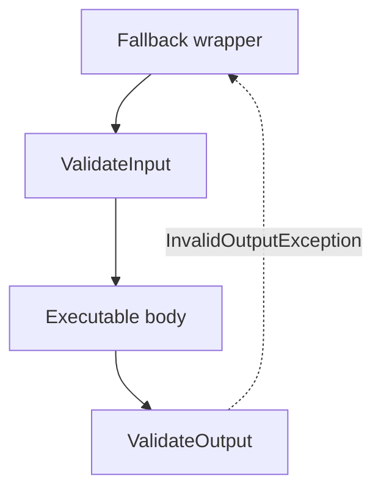

# Policies

Policies are reusable execution rules applied at the executor layer.

They are useful when execution needs runtime constraints or recovery behavior around an otherwise unchanged executable
composition.

Typical examples include:

- input and output validation,
- access guards,
- fallbacks,
- retry and timeout,
- reentrancy control,
- completion-driven cancellation for async races.

## Applying Policies

`WithPolicy(...)` is the main entry point for both `IExecutor<TIn, TOut>` and `IAsyncExecutor<TIn, TOut>`.

```csharp
IExecutor<string, int> parse =
  Executable.Create((string text) => int.Parse(text))
    .GetExecutor()
    .WithPolicy(builder => builder
      .ValidateInput(text => !string.IsNullOrWhiteSpace(text), "Value is required")
      .Fallback<FormatException>((text, _) => 0));
```

The executable composition stays the same. Policies only change how that composition is executed.

## Validation

Validation keeps contract checks at the execution boundary instead of mixing them into the executable body.

Use:

- `ValidateInput(...)` for request validation,
- `ValidateOutput(...)` for response validation,
- `Validate(...)` when both belong in one policy.

```csharp
IExecutor<string, string> executor =
  Executable.Create((string text) => $"response: {text}")
    .GetExecutor()
    .WithPolicy(builder => builder.ValidateInput(Validator.NotEmptyString));
```

Validation failures throw `InvalidInputException` or `InvalidOutputException`.

Predicate-based overloads are useful for small rules. `Validator<T>` objects are better when validation itself becomes a
reusable concept.

## Validator API

`Validator<T>` is the reusable building block behind validation policies.

It becomes useful when the same rule should be shared across several executors or composed from smaller rules.

The factory API covers several common shapes:

- value comparison: `Equal(...)`, `NotEqual(...)`, `MoreThan(...)`, `LessThan(...)`, `MoreThanOrEqual(...)`, `LessThanOrEqual(...)`,
- ranges: `InRange(...)`, `OutRange(...)`,
- string and collection helpers: `NotEmptyString`, `StringLength(...)`, `CollectionCount(...)`, `NotEmptyCollection<T>()`,
- sequence rules: `All(...)`, `Any(...)`,
- type and regex checks: `Is<TExpected>()`, `Match(...)`,
- ad-hoc rules: `Create(...)`,
- neutral pass-through: `Identity<T>()`.

Validators can then be composed with:

- `And(...)`
- `Or(...)`
- `Not(...)`
- `OverrideMessage(...)`

```csharp
Validator<int> validator =
  Validator.InRange(0, 10)
    .And(Validator.NotEqual(5))
    .OverrideMessage("Value must be between 0 and 10, except 5");
```

```csharp
using static Executables.Validation.Validator;

Validator<int> validator = MoreThan(0).Or(Equal(0)).And(LessThan(10));
```

That validator API fits naturally with policies:

```csharp
using static Executables.Validation.Validator;

IExecutor<int, int> executor = Executable
  .Create((int x) => x * 2)
  .GetExecutor()
  .WithPolicy(builder => builder.ValidateInput(InRange(0, 100).And(NotEqual(42))));
```

## Guards

Guards represent external permission or availability checks.

They answer a different question than validation:

- validation asks whether the input or output is valid,
- guard asks whether execution is allowed at all.

```csharp
bool isEnabled = true;

IExecutor<Unit, string> executor =
  Executable.Create(() => "Started")
    .GetExecutor()
    .WithPolicy(builder => builder.Guard(() => isEnabled, "Operation is disabled"));
```

When a guard denies execution, it throws `AccessDeniedException`.

For reusable guard logic, use `Guard.Create(...)`, `Guard.Manual(...)`, and guard composition instead of repeating
inline predicates.

## Fallback

Fallback converts a handled exception into a replacement result.

```csharp
IExecutor<string, int> executor =
  Executable.Create((string text) => int.Parse(text))
    .GetExecutor()
    .WithPolicy(builder => builder.Fallback<FormatException>((text, _) => 0));
```

Fallback is still a policy-layer concern. It recovers from a runtime failure without changing the executable chain
itself.

Unlike `MapException(...)`, fallback does not replace one exception with another. It produces a normal result.

## Timeout and Retry

`Timeout(...)` and `Retry(...)` are asynchronous policies.

Use timeout when a single invocation has a maximum allowed duration.

```csharp
IAsyncExecutor<int, int> executor = AsyncExecutable
  .Create(async (int value, CancellationToken token) =>
  {
    await Task.Delay(10, token);
    return value * 2;
  })
  .GetExecutor()
  .WithPolicy(builder => builder.Timeout(TimeSpan.FromMilliseconds(100)));
```

Use retry when a specific exception can be handled by trying again under a retry rule.

```csharp
var failuresLeft = 3;

IAsyncExecutor<int, int> executor = AsyncExecutable
  .Create(async (int value, CancellationToken token) =>
  {
    if (failuresLeft-- > 0)
      throw new InvalidOperationException();

    await Task.Delay(50, token);
    return value * 2;
  })
  .GetExecutor()
  .WithPolicy(builder => builder.Retry(
    RetryRule.ExponentialBackoff<InvalidOperationException>(TimeSpan.FromMilliseconds(10), maxAttempts: 5)));
```

`Retry(...)` accepts either:

- an `IRetryRule<TException>`,
- or an async delegate rule through `RetryRule.Create(...)`.

## Reentrancy Control

`PreventReentrance()` rejects nested re-entry into the same execution flow.

This is useful when the same executor must not be re-invoked while an earlier invocation is still active.

```csharp
var query = new Query<Unit, Unit>();

IExecutor<Unit, Unit> executor =
  query.GetExecutor()
    .WithPolicy(builder => builder.PreventReentrance());

query.Handle(Executable.Create(void () => executor.Execute()).AsHandler());
```

Calling `executor.Execute()` in this setup throws `ReentranceException`, because the handler tries to enter the same
guarded execution again before the previous invocation completes.

The async version follows the same idea through `AsyncPolicyBuilder<TIn, TOut>.PreventReentrance()`.

## Cancel After Completion

`CancelAfterCompletion()` is an async policy for linked execution graphs where one completed branch makes the rest no
longer useful.

It is especially useful together with `Race(...)` and `RaceSuccess(...)`.

```csharp
IAsyncExecutor<string, string> fastest =
  AsyncExecutable.Race(
      async (string text, CancellationToken token) =>
      {
        await Task.Delay(100, token);
        return $"Slow: {text}";
      },
      async (string text, CancellationToken token) =>
      {
        await Task.Delay(5, token);
        return $"Fast: {text}";
      })
    .GetExecutor()
    .WithPolicy(builder => builder.CancelAfterCompletion());
```

Once one branch completes, the linked cancellation token is canceled for the remaining work.

## Policy Order

Policies are applied in reverse order of addition: the last added policy executes first.

That matters whenever several policies can observe the same failure or wrap the same call.

```csharp
IExecutor<int, int> executor = Executable
  .Create((int x) => x * 2)
  .GetExecutor()
  .WithPolicy(builder => builder
    .ValidateInput(value => value > 0, "Value must be positive")
    .ValidateOutput(value => value < 1000, "Value is too large")
    .Fallback<InvalidOutputException>((value, _) => value));
```

Runtime flow for that example:



In this example:

- input validation runs before the executable,
- output validation runs after it,
- fallback can recover from `InvalidOutputException`.
